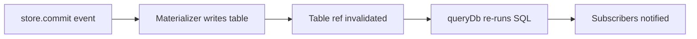

`queryDb` creates a `LiveQueryDef` — a reusable, reactive query definition that runs against the local SQLite state. When the tables it reads change (because events were committed), any subscriber to the query is notified and the query re-executes.

## Function signature

```typescript
export const queryDb: {
  // Overload 1: static query (query builder or raw SQL object)
  <TResultSchema, TResult = TResultSchema>(
    queryInput:
      | QueryInputRaw<TResultSchema, ReadonlyArray<any>>
      | QueryBuilder<TResultSchema, any, any>,
    options?: {
      map?: (rows: TResultSchema) => TResult
      label?: string
      deps?: DepKey
    },
  ): LiveQueryDef<TResult>

  // Overload 2: dynamic query (function that receives `get` to read other reactive state)
  <TResultSchema, TResult = TResultSchema>(
    queryInput:
      | ((get: GetAtomResult) => QueryInputRaw<TResultSchema, ReadonlyArray<any>>)
      | ((get: GetAtomResult) => QueryBuilder<TResultSchema, any, any>),
    options?: {
      map?: (rows: TResultSchema) => TResult
      label?: string
      deps?: DepKey
    },
  ): LiveQueryDef<TResult>
}
```

### Return type

`queryDb` returns a `LiveQueryDef<TResult>`. This is a reusable definition — not an active query. Pass it to `store.query()` for a one-shot read or `store.subscribe()` / `store.useQuery()` for reactive updates.

---

## Parameters

<ParamField body="queryInput" type="QueryBuilder | QueryInputRaw | (get) => QueryBuilder | QueryInputRaw" required>
  The query to execute. Three forms are accepted:

  - **Query builder** — type-safe builder expression from a table definition (e.g. `tables.todos.where({ completed: false })`)
  - **Raw SQL object** — `{ query, schema, bindValues? }` for queries the builder cannot express
  - **Thunk function** — `(get) => QueryBuilder | QueryInputRaw` for queries that depend on other reactive state
</ParamField>

<ParamField body="options.label" type="string">
  Human-readable name shown in the DevTools. Recommended for all queries to ease debugging.
</ParamField>

<ParamField body="options.deps" type="DepKey">
  Explicit dependency array. **Required on Expo / React Native** where `fn.toString()` returns `[native code]`. Also use this when the query function closes over external variables that should invalidate the query definition.

  ```typescript
  type DepKey = string | ReadonlyArray<string | number | boolean | undefined | null>
  ```
</ParamField>

<ParamField body="options.map" type="(rows: TResultSchema) => TResult">
  Optional transform applied to the raw query result before it is stored. Useful for post-processing or reshaping data.
</ParamField>

---

## Usage

### Query builder (recommended)

The query builder is the primary way to query data. It provides type safety and automatically tracks which tables the query reads.

```typescript
import { queryDb } from '@livestore/livestore'
import { tables } from './schema.ts'

// All rows, ordered
const todos$ = queryDb(
  tables.todos.orderBy('createdAt', 'desc'),
  { label: 'todos$' },
)

// Filtered rows
const activeTodos$ = queryDb(
  tables.todos.where({ completed: false }),
  { label: 'activeTodos$' },
)

// Count
const todoCount$ = queryDb(
  tables.todos.count(),
  { label: 'todoCount$' },
)
```

### Raw SQL

Use the `{ query, schema, bindValues }` form for queries that the builder cannot express, such as GROUP BY, JOIN, or window functions.

```typescript
import { queryDb, Schema, sql } from '@livestore/livestore'

const colorCounts$ = queryDb(
  {
    query: sql`SELECT color, COUNT(*) as count FROM todos WHERE completed = ? GROUP BY color`,
    schema: Schema.Array(
      Schema.Struct({ color: Schema.String, count: Schema.Number }),
    ),
    bindValues: [0],
  },
  { label: 'colorCounts$' },
)
```

<Warning>
  `queryDb` is read-only. Never use `INSERT`, `UPDATE`, or `DELETE` inside a query. Mutate state by committing events.
</Warning>

### Dynamic queries with `deps`

When a query depends on external variables (for example, a search string from a URL parameter), wrap the query builder in a function. Include the variable in `deps` so the query definition is re-keyed when it changes.

```typescript
const makeFilteredTodos = (filter: string) =>
  queryDb(
    () => tables.todos.where({ text: { $like: `%${filter}%` } }),
    {
      label: 'filteredTodos$',
      deps: [filter],
    },
  )

// Create a new definition each time `filter` changes
const todos$ = makeFilteredTodos('buy coffee')
```

### Reactive dependencies with `get`

When a query should automatically react to another signal or computed value, use a function that calls `get(otherQuery$)` to read its current value and register a dependency.

```typescript
import { queryDb, signal } from '@livestore/livestore'

const uiState$ = signal({ showCompleted: false }, { label: 'uiState$' })

const todos$ = queryDb(
  (get) => {
    const { showCompleted } = get(uiState$)
    return tables.todos.where(showCompleted ? { completed: true } : {})
  },
  { label: 'todos$' },
)
```

When `uiState$` changes, `todos$` re-executes its query function and fetches a fresh result. The dependency is established automatically — no `deps` array is required unless you are on Expo / React Native.

---

## How reactive queries work



1. You call `store.commit(event)`.
2. The materializer writes to one or more SQLite tables.
3. LiveStore tracks which tables changed and invalidates the reactive refs for those tables.
4. All `queryDb` queries that read any of those tables are scheduled to re-execute.
5. Subscribers (React hooks, `store.subscribe()` callbacks) receive the new result.

Queries are memoized: if the new result is structurally equal to the previous result (via Effect Schema equivalence), downstream subscribers are not notified.

---

## Accessing query results

A `LiveQueryDef` is a definition, not a result. Access the data in one of these ways:

```typescript
// One-shot read (non-reactive)
const todos = store.query(todos$)

// Reactive subscription
const unsubscribe = store.subscribe(todos$, (todos) => {
  console.log('updated:', todos)
})

// React hook
const todos = store.useQuery(todos$)
```

---

## Raw SQL object shape

When passing a raw SQL object, the `schema` field describes the shape of one row. LiveStore decodes the raw SQLite result using this schema.

```typescript
type QueryInputRaw<TDecoded, TEncoded> = {
  query: string
  schema: Schema.Schema<TDecoded, TEncoded>
  bindValues?: Bindable           // positional array or named { $key: value } object
  queriedTables?: Set<string>     // optional hint to skip automatic table detection
}
```

<Tip>
  Providing `queriedTables` explicitly can slightly improve first-run performance by skipping the automatic SQL parsing step used to identify which tables the query reads.
</Tip>

---

## Performance considerations

- **Memoization** — Results are compared with Effect Schema equivalence. Structurally identical results do not re-trigger downstream effects.
- **Batch commits** — When committing many events at once, use `{ skipRefresh: true }` and call `store.manualRefresh()` after to batch reactive notifications.
- **Table granularity** — Reactivity is per-table. A commit to `todos` does not invalidate queries that only read `uiState`.
- **Deps stability** — Keep the `deps` array stable across renders. Changing a dep key forces the query definition to be recreated and re-executed.
